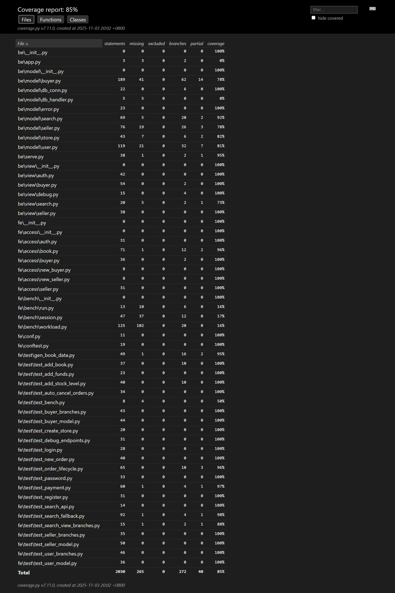

# 2025_ECNU_PJ1_第23组 Bookstore项目报告

## 1. 组员信息与分工

### 组员信息
- **组员1**：学号：10233330407，姓名：李晨语
  - 分工：负责买家与卖家模块、订单生命周期、搜索功能、用户鉴权模块、数据库设计与SQLite集成、测试用例编写
  
- **组员2**：学号：10235501469，姓名：邵乐怡
  - 分工：负责报告撰写、MongoDB集成、测试用例编写、项目性能调试与优化

---

## 2. 文档数据库设计

### 2.1 MongoDB 数据库 Schema

本项目采用混合数据库架构：SQLite用于事务性数据（用户、订单、店铺关系），MongoDB用于图书信息存储和全文检索。

#### 2.1.1 MongoDB 集合设计

**books 集合**（图书信息）
```javascript
{
  "_id": ObjectId,           // MongoDB自动生成
  "id": String,               // 图书ID（主键，来自SQLite）
  "title": String,            // 书名
  "author": String,           // 作者
  "publisher": String,        // 出版社
  "original_title": String,   // 原书名
  "translator": String,       // 译者
  "pub_year": String,         // 出版年份
  "pages": Integer,           // 页数
  "price": Integer,           // 价格（分为单位）
  "currency_unit": String,    // 货币单位
  "binding": String,          // 装帧
  "isbn": String,             // ISBN号
  "author_intro": String,     // 作者简介
  "book_intro": String,       // 图书简介
  "content": String,          // 内容
  "tags": String              // 标签（逗号分隔）
}
```

**索引设计**：
- 全文索引：`{title: "text", tags: "text", book_intro: "text", content: "text", author_intro: "text"}`
  - 权重：title(10), tags(5), book_intro(2), content(1)
  - 用于全文搜索优化

**users 集合**（用户信息，MongoDB中预留）
```javascript
{
  "user_id": String,          // 用户名（唯一索引）
  "password": String,         // 密码
  "balance": Integer,         // 余额
  "token": String,            // 登录token
  "terminal": String          // 终端标识
}
```

**user_store 集合**（店铺关系）
```javascript
{
  "_id": ObjectId,
  "store_id": String,         // 店铺ID
  "user_id": String           // 卖家用户ID
}
```
- 复合唯一索引：`{store_id: 1, user_id: 1}`

**store 集合**（店铺图书库存）
```javascript
{
  "_id": ObjectId,
  "store_id": String,         // 店铺ID
  "book_id": String,          // 图书ID
  "book_info": String,        // 图书信息（JSON字符串）
  "stock_level": Integer      // 库存数量
}
```
- 复合唯一索引：`{store_id: 1, book_id: 1}`

**new_order 集合**（订单主表）
```javascript
{
  "_id": ObjectId,
  "order_id": String,         // 订单ID（唯一索引）
  "store_id": String,         // 店铺ID
  "user_id": String,          // 买家用户ID
  "status": String,           // 订单状态：created/paid/shipped/received
  "create_time": Integer,     // 创建时间戳
  "pay_time": Integer,        // 支付时间戳
  "ship_time": Integer,       // 发货时间戳
  "receive_time": Integer     // 收货时间戳
}
```
- 唯一索引：`{order_id: 1}`

**new_order_detail 集合**（订单明细）
```javascript
{
  "_id": ObjectId,
  "order_id": String,         // 订单ID
  "book_id": String,          // 图书ID
  "count": Integer,           // 购买数量
  "price": Integer            // 单价
}
```
- 复合唯一索引：`{order_id: 1, book_id: 1}`

#### 2.1.2 SQLite 数据库 Schema（兼容层）

为了保持与原有代码的兼容性，项目同时维护了SQLite内存数据库，用于事务性操作：

```sql
-- 用户表
CREATE TABLE user (
    user_id TEXT PRIMARY KEY,
    password TEXT,
    balance INTEGER,
    token TEXT,
    terminal TEXT
);

-- 店铺关系表
CREATE TABLE user_store (
    store_id TEXT PRIMARY KEY,
    user_id TEXT
);

-- 店铺库存表
CREATE TABLE store (
    store_id TEXT,
    book_id TEXT,
    book_info TEXT,
    stock_level INTEGER,
    PRIMARY KEY(store_id, book_id)
);

-- 订单主表
CREATE TABLE new_order (
    order_id TEXT PRIMARY KEY,
    store_id TEXT,
    user_id TEXT,
    status TEXT,
    create_time INTEGER,
    pay_time INTEGER,
    ship_time INTEGER,
    receive_time INTEGER
);

-- 订单明细表
CREATE TABLE new_order_detail (
    order_id TEXT,
    book_id TEXT,
    count INTEGER,
    price INTEGER
);
```

### 2.2 数据迁移方案

从SQLite的`book`表迁移到MongoDB的`books`集合：
- 使用`fe/data/import_books_mongo.py`脚本进行数据迁移
- 自动创建全文索引，优化搜索性能
- 支持增量导入和全量导入
```python
# fe/data/import_books_mongo.py

def import_books(sqlite_file, mongo_url="mongodb://localhost:27017/", mongo_db="bookstore"):
    conn = sqlite3.connect(sqlite_file)
    cur = conn.cursor()
    cur.execute("SELECT id, title, author, publisher, original_title, translator, pub_year, pages, price, currency_unit, binding, isbn, author_intro, book_intro, content, tags FROM book")

    client = MongoClient(mongo_url)
    db = client[mongo_db]
    books = db.books
    # Optional: remove existing to reimport
    books.delete_many({})

    rows = cur.fetchall()
    docs = []
    for r in rows:
        doc = {
            "id": r[0],
            "title": r[1],
            "author": r[2],
            "publisher": r[3],
            "original_title": r[4],
            "translator": r[5],
            "pub_year": r[6],
            "pages": r[7],
            "price": r[8],
            "currency_unit": r[9],
            "binding": r[10],
            "isbn": r[11],
            "author_intro": r[12],
            "book_intro": r[13],
            "content": r[14],
            "tags": r[15],
        }
        docs.append(doc)

    if docs:
        books.insert_many(docs)

    # create text index across several fields; weight title higher
    try:
        books.create_index(
            [("title", TEXT), ("tags", TEXT), ("book_intro", TEXT), ("content", TEXT), ("author_intro", TEXT)],
            name="text_index",
            default_language="english",
            weights={"title": 10, "tags": 5, "book_intro": 2, "content": 1},
        )
    except Exception as e:
        print("Warning: could not create text index:", e)

    print(f"Imported {len(docs)} books into MongoDB {mongo_db}.books")

```

---

## 3. 功能实现详解

### 3.1 60% 基础功能实现

#### 3.1.1 用户权限接口（auth模块）

**实现位置**：`be/view/auth.py`, `be/model/user.py`

**接口列表**：
1. **注册用户** (`POST /auth/register`)
   - 后端逻辑：`User.register()`
   - 数据库操作：向SQLite的`user`表插入新用户，初始余额为0，生成JWT token
   - 测试用例：`fe/test/test_register.py`

2. **用户登录** (`POST /auth/login`)
   - 后端逻辑：`User.login()`
   - 数据库操作：验证密码，更新token和terminal，使用JWT编码token
   - 测试用例：`fe/test/test_login.py`

3. **用户登出** (`POST /auth/logout`)
   - 后端逻辑：`User.logout()`
   - 数据库操作：验证token，更新为无效token
   - 测试用例：`fe/test/test_user_branches.py`

4. **注销用户** (`POST /auth/unregister`)
   - 后端逻辑：`User.unregister()`
   - 数据库操作：验证密码后删除用户记录
   - 测试用例：`fe/test/test_user_model.py`

5. **修改密码** (`POST /auth/password`)
   - 后端逻辑：`User.change_password()`
   - 数据库操作：验证旧密码，更新密码并重新生成token
   - 测试用例：`fe/test/test_password.py`


#### 3.1.2 买家用户接口（buyer模块）

**实现位置**：`be/view/buyer.py`, `be/model/buyer.py`

**接口列表**：
1. **买家充值** (`POST /buyer/add_funds`)
   - 后端逻辑：`Buyer.add_funds()`
   - 数据库操作：验证密码，更新用户余额
   - 测试用例：`fe/test/test_add_funds.py`
  ```python
    #be/model/buyer.py

      def add_funds(self, user_id, password, add_value) -> (int, str):
        try:
            cursor = self.conn.execute(
                "SELECT password  from user where user_id=?", (user_id,)
            )
            row = cursor.fetchone()
            if row is None:
                return error.error_authorization_fail()

            if row[0] != password:
                return error.error_authorization_fail()

            cursor = self.conn.execute(
                "UPDATE user SET balance = balance + ? WHERE user_id = ?",
                (add_value, user_id),
            )
            if cursor.rowcount == 0:
                return error.error_non_exist_user_id(user_id)

            self.conn.commit()
        except sqlite.Error as e:
            return 528, "{}".format(str(e))
        except BaseException as e:
            return 530, "{}".format(str(e))

        return 200, "ok"

  ```

2. **买家下单** (`POST /buyer/new_order`)
   - 后端逻辑：`Buyer.new_order()`
   - 数据库操作：
     - 验证用户和店铺存在性
     - 检查库存并原子性扣减（使用`WHERE stock_level >= count`保证并发安全）
     - 插入订单主表和明细表
   - 测试用例：`fe/test/test_new_order.py`
  ```python
  #be/model/buyer.py

    def new_order(
        self, user_id: str, store_id: str, id_and_count: [(str, int)]
    ) -> (int, str, str):
        order_id = ""
        try:
            if not self.user_id_exist(user_id):
                return error.error_non_exist_user_id(user_id) + (order_id,)
            if not self.store_id_exist(store_id):
                return error.error_non_exist_store_id(store_id) + (order_id,)
            uid = "{}_{}_{}".format(user_id, store_id, str(uuid.uuid1()))

            for book_id, count in id_and_count:
                cursor = self.conn.execute(
                    "SELECT book_id, stock_level, book_info FROM store "
                    "WHERE store_id = ? AND book_id = ?;",
                    (store_id, book_id),
                )
                row = cursor.fetchone()
                if row is None:
                    return error.error_non_exist_book_id(book_id) + (order_id,)

                stock_level = row[1]
                book_info = row[2]
                book_info_json = json.loads(book_info)
                price = book_info_json.get("price")

                if stock_level < count:
                    return error.error_stock_level_low(book_id) + (order_id,)

                cursor = self.conn.execute(
                    "UPDATE store set stock_level = stock_level - ? "
                    "WHERE store_id = ? and book_id = ? and stock_level >= ?; ",
                    (count, store_id, book_id, count),
                )
                if cursor.rowcount == 0:
                    return error.error_stock_level_low(book_id) + (order_id,)

                self.conn.execute(
                    "INSERT INTO new_order_detail(order_id, book_id, count, price) "
                    "VALUES(?, ?, ?, ?);",
                    (uid, book_id, count, price),
                )
            # insert order record with status and creation time
            create_time = int(time.time())
            self.conn.execute(
                "INSERT INTO new_order(order_id, store_id, user_id, status, create_time) "
                "VALUES(?, ?, ?, ?, ?);",
                (uid, store_id, user_id, "created", create_time),
            )
            self.conn.commit()
            order_id = uid
        except sqlite.Error as e:
            logging.info("528, {}".format(str(e)))
            return 528, "{}".format(str(e)), ""
        except BaseException as e:
            logging.info("530, {}".format(str(e)))
            return 530, "{}".format(str(e)), ""

        return 200, "ok", order_id
```

1. **买家付款** (`POST /buyer/payment`)
   - 后端逻辑：`Buyer.payment()`
   - 数据库操作：
     - 验证订单状态和权限
     - 计算订单总价
     - 原子性扣减买家余额，增加卖家余额
     - 更新订单状态为"paid"
   - 测试用例：`fe/test/test_payment.py`
```python
#be/model/buyer.py

    def payment(self, user_id: str, password: str, order_id: str) -> (int, str):
        conn = self.conn
        try:
            cursor = conn.execute(
                "SELECT order_id, user_id, store_id FROM new_order WHERE order_id = ?",
                (order_id,),
            )
            row = cursor.fetchone()
            if row is None:
                return error.error_invalid_order_id(order_id)

            order_id = row[0]
            buyer_id = row[1]
            store_id = row[2]

            if buyer_id != user_id:
                return error.error_authorization_fail()

            cursor = conn.execute(
                "SELECT balance, password FROM user WHERE user_id = ?;", (buyer_id,)
            )
            row = cursor.fetchone()
            if row is None:
                return error.error_non_exist_user_id(buyer_id)
            balance = row[0]
            if password != row[1]:
                return error.error_authorization_fail()

            cursor = conn.execute(
                "SELECT store_id, user_id FROM user_store WHERE store_id = ?;",
                (store_id,),
            )
            row = cursor.fetchone()
            if row is None:
                return error.error_non_exist_store_id(store_id)

            seller_id = row[1]

            if not self.user_id_exist(seller_id):
                return error.error_non_exist_user_id(seller_id)

            cursor = conn.execute(
                "SELECT book_id, count, price FROM new_order_detail WHERE order_id = ?;",
                (order_id,),
            )
            total_price = 0
            for row in cursor:
                count = row[1]
                price = row[2]
                total_price = total_price + price * count

            if balance < total_price:
                return error.error_not_sufficient_funds(order_id)

            cursor = conn.execute(
                "UPDATE user set balance = balance - ?"
                "WHERE user_id = ? AND balance >= ?",
                (total_price, buyer_id, total_price),
            )
            if cursor.rowcount == 0:
                return error.error_not_sufficient_funds(order_id)

            cursor = conn.execute(
                "UPDATE user set balance = balance + ?" "WHERE user_id = ?",
                (total_price, seller_id),
            )

            if cursor.rowcount == 0:
                return error.error_non_exist_user_id(seller_id)

            # mark order as paid (do not remove order records)
            pay_time = int(time.time())
            cursor = conn.execute(
                "UPDATE new_order SET status = ?, pay_time = ? WHERE order_id = ?",
                ("paid", pay_time, order_id),
            )
            if cursor.rowcount == 0:
                return error.error_invalid_order_id(order_id)
            conn.commit()

        except sqlite.Error as e:
            return 528, "{}".format(str(e))

        except BaseException as e:
            return 530, "{}".format(str(e))

        return 200, "ok"
```

#### 3.1.3 卖家用户接口（seller模块）

**实现位置**：`be/view/seller.py`, `be/model/seller.py`

**接口列表**：
1. **创建店铺** (`POST /seller/create_store`)
   - 后端逻辑：`Seller.create_store()`
   - 数据库操作：验证用户存在，向`user_store`表插入店铺关系
   - 测试用例：`fe/test/test_create_store.py`
  ```python
  #be/model/seller.py

    def create_store(self, user_id: str, store_id: str) -> (int, str):
        try:
            if not self.user_id_exist(user_id):
                return error.error_non_exist_user_id(user_id)
            if self.store_id_exist(store_id):
                return error.error_exist_store_id(store_id)
            self.conn.execute(
                "INSERT into user_store(store_id, user_id)" "VALUES (?, ?)",
                (store_id, user_id),
            )
            self.conn.commit()
        except sqlite.Error as e:
            return 528, "{}".format(str(e))
        except BaseException as e:
            return 530, "{}".format(str(e))
        return 200, "ok"
```

2. **添加书籍信息** (`POST /seller/add_book`)
   - 后端逻辑：`Seller.add_book()`
   - 数据库操作：验证店铺和用户，向`store`表插入图书信息（book_info为JSON字符串）
   - 测试用例：`fe/test/test_add_book.py`
  ```python
  #be/model/seller.py
  
    def add_book(
        self,
        user_id: str,
        store_id: str,
        book_id: str,
        book_json_str: str,
        stock_level: int,
    ):
        try:
            if not self.user_id_exist(user_id):
                return error.error_non_exist_user_id(user_id)
            if not self.store_id_exist(store_id):
                return error.error_non_exist_store_id(store_id)
            if self.book_id_exist(store_id, book_id):
                return error.error_exist_book_id(book_id)
            
            self.conn.execute(
                "INSERT into store(store_id, book_id, book_info, stock_level)"
                "VALUES (?, ?, ?, ?)",
                (store_id, book_id, book_json_str, stock_level),
            )
            self.conn.commit()
        except sqlite.Error as e:
            return 528, "{}".format(str(e))
        except BaseException as e:
            return 530, "{}".format(str(e))
        return 200, "ok"
```

3. **增加库存** (`POST /seller/add_stock_level`)
   - 后端逻辑：`Seller.add_stock_level()`
   - 数据库操作：验证图书存在，原子性增加库存
   - 测试用例：`fe/test/test_add_stock_level.py`
  ```python
  #be/model/seller.py

    def add_stock_level(
        self, user_id: str, store_id: str, book_id: str, add_stock_level: int
    ):
        try:
            if not self.user_id_exist(user_id):
                return error.error_non_exist_user_id(user_id)
            if not self.store_id_exist(store_id):
                return error.error_non_exist_store_id(store_id)
            if not self.book_id_exist(store_id, book_id):
                return error.error_non_exist_book_id(book_id)

            self.conn.execute(
                "UPDATE store SET stock_level = stock_level + ? "
                "WHERE store_id = ? AND book_id = ?",
                (add_stock_level, store_id, book_id),
            )
            self.conn.commit()
        except sqlite.Error as e:
            return 528, "{}".format(str(e))
        except BaseException as e:
            return 530, "{}".format(str(e))
        return 200, "ok"
```


**设计要点**：
- 店铺与卖家的关系通过`user_store`表维护
- 图书信息以JSON格式存储在`store`表的`book_info`字段
- 库存更新使用原子操作保证一致性

---

### 3.2 40% 附加功能实现

#### 3.2.1 订单生命周期管理

**实现位置**：`be/view/buyer.py`, `be/view/seller.py`, `be/model/buyer.py`, `be/model/seller.py`

**新增接口**：
1. **取消订单** (`POST /buyer/cancel_order`)
   - 后端逻辑：`Buyer.cancel_order()`
   - 数据库操作：
     - 验证订单状态为"created"（未支付状态）
     - 恢复库存
     - 删除订单记录
   - 测试用例：`fe/test/test_order_lifecycle.py`
```python
#be/model/buyer.py

    def cancel_order(self, user_id: str, order_id: str) -> (int, str):
        try:
            cursor = self.conn.execute(
                "SELECT order_id, user_id, store_id, status FROM new_order WHERE order_id = ?",
                (order_id,),
            )
            row = cursor.fetchone()
            if row is None:
                return error.error_invalid_order_id(order_id)
            if row[1] != user_id:
                return error.error_authorization_fail()
            status = row[3]
            if status != "created":
                # only allow cancel before payment
                return error.error_and_message(530, "order cannot be canceled in status {}".format(status))

            # restore stock levels
            cursor = self.conn.execute(
                "SELECT book_id, count FROM new_order_detail WHERE order_id = ?",
                (order_id,),
            )
            for r in cursor:
                book_id = r[0]
                count = r[1]
                self.conn.execute(
                    "UPDATE store SET stock_level = stock_level + ? WHERE book_id = ? AND store_id = ?",
                    (count, book_id, row[2]),
                )

            # delete order and details
            self.conn.execute("DELETE FROM new_order_detail WHERE order_id = ?", (order_id,))
            self.conn.execute("DELETE FROM new_order WHERE order_id = ?", (order_id,))
            self.conn.commit()
            return 200, "ok"
        except sqlite.Error as e:
            return 528, "{}".format(str(e))
        except BaseException as e:
            return 530, "{}".format(str(e))
```
2. **发货** (`POST /seller/ship`)
   - 后端逻辑：`Seller.ship_order()`
   - 数据库操作：
     - 验证卖家拥有该店铺
     - 验证订单状态为"paid"
     - 更新订单状态为"shipped"，记录发货时间
   - 测试用例：`fe/test/test_order_lifecycle.py`
  ```python
  #be/model/seller.py

    def ship_order(self, user_id: str, order_id: str) -> (int, str):
        try:
            # check order exists
            cursor = self.conn.execute(
                "SELECT order_id, store_id, status FROM new_order WHERE order_id = ?",
                (order_id,),
            )
            row = cursor.fetchone()
            if row is None:
                return error.error_invalid_order_id(order_id)
            store_id = row[1]
            status = row[2]

            # check seller owns the store
            cursor = self.conn.execute(
                "SELECT user_id FROM user_store WHERE store_id = ?;",
                (store_id,),
            )
            r = cursor.fetchone()
            if r is None:
                return error.error_non_exist_store_id(store_id)
            seller_id = r[0]
            if seller_id != user_id:
                return error.error_authorization_fail()

            if status != "paid":
                return error.error_and_message(530, "order not paid or already shipped")

            ship_time = int(__import__("time").time())
            cursor = self.conn.execute(
                "UPDATE new_order SET status = ?, ship_time = ? WHERE order_id = ?",
                ("shipped", ship_time, order_id),
            )
            if cursor.rowcount == 0:
                return error.error_invalid_order_id(order_id)
            self.conn.commit()
            return 200, "ok"
        except sqlite.Error as e:
            return 528, "{}".format(str(e))
        except BaseException as e:
            return 530, "{}".format(str(e))
```


3. **收货** (`POST /buyer/receive`)
   - 后端逻辑：`Buyer.receive_order()`
   - 数据库操作：
     - 验证订单状态为"shipped"
     - 更新订单状态为"received"，记录收货时间
   - 测试用例：`fe/test/test_order_lifecycle.py`
```python
#be/model/buyer.py

    def receive_order(self, user_id: str, order_id: str) -> (int, str):
        try:
            cursor = self.conn.execute(
                "SELECT order_id, user_id, status FROM new_order WHERE order_id = ?",
                (order_id,),
            )
            row = cursor.fetchone()
            if row is None:
                return error.error_invalid_order_id(order_id)
            if row[1] != user_id:
                return error.error_authorization_fail()
            status = row[2]
            if status != "shipped":
                return error.error_and_message(530, "order not in shipped status")
            receive_time = int(time.time())
            self.conn.execute(
                "UPDATE new_order SET status = ?, receive_time = ? WHERE order_id = ?",
                ("received", receive_time, order_id),
            )
            self.conn.commit()
            return 200, "ok"
        except sqlite.Error as e:
            return 528, "{}".format(str(e))
        except BaseException as e:
            return 530, "{}".format(str(e))
```
4. **查询订单** (`GET /buyer/query_orders`)
   - 后端逻辑：`Buyer.query_orders()`
   - 数据库操作：查询用户的所有订单，包括订单明细
   - 测试用例：`fe/test/test_order_lifecycle.py`
```python
#be/model/buyer.py

    def query_orders(self, user_id: str):
        try:
            cursor = self.conn.execute(
                "SELECT order_id, store_id, status, create_time, pay_time, ship_time, receive_time FROM new_order WHERE user_id = ?",
                (user_id,),
            )
            orders = []
            for row in cursor:
                order_id = row[0]
                details_cursor = self.conn.execute(
                    "SELECT book_id, count, price FROM new_order_detail WHERE order_id = ?",
                    (order_id,),
                )
                details = [dict(book_id=r[0], count=r[1], price=r[2]) for r in details_cursor]
                orders.append(
                    {
                        "order_id": order_id,
                        "store_id": row[1],
                        "status": row[2],
                        "create_time": row[3],
                        "pay_time": row[4],
                        "ship_time": row[5],
                        "receive_time": row[6],
                        "details": details,
                    }
                )
            return 200, "ok", orders
        except sqlite.Error as e:
            return 528, "{}".format(str(e)), []
```
5. **自动取消超时未支付订单**
   - 后端逻辑：`Buyer.auto_cancel_unpaid()`
   - 数据库操作：查找超时未支付订单，批量恢复库存并删除订单
   - 测试用例：`fe/test/test_auto_cancel_orders.py`
```python
#be/model/buyer.py

    def auto_cancel_unpaid(self, timeout_seconds: int) -> (int, str, int):
        """Cancel orders that remain in 'created' status longer than timeout_seconds.

        Restores stock levels and deletes the order and its details. Returns
        (code, message, cancelled_count).
        """
        try:
            now = int(time.time())
            cutoff = now - int(timeout_seconds)
            cursor = self.conn.execute(
                "SELECT order_id, store_id FROM new_order WHERE status = ? AND create_time <= ?",
                ("created", cutoff),
            )
            orders = [(r[0], r[1]) for r in cursor]
            cancelled = 0
            for order_id, store_id in orders:
                # restore stock
                details_cursor = self.conn.execute(
                    "SELECT book_id, count FROM new_order_detail WHERE order_id = ?",
                    (order_id,),
                )
                for r in details_cursor:
                    book_id = r[0]
                    count = r[1]
                    self.conn.execute(
                        "UPDATE store SET stock_level = stock_level + ? WHERE book_id = ? AND store_id = ?",
                        (count, book_id, store_id),
                    )

                # remove details and order record
                self.conn.execute("DELETE FROM new_order_detail WHERE order_id = ?", (order_id,))
                self.conn.execute("DELETE FROM new_order WHERE order_id = ?", (order_id,))
                cancelled += 1

            if cancelled > 0:
                self.conn.commit()

            return 200, "ok", cancelled
        except sqlite.Error as e:
            return 528, "{}".format(str(e)), 0
        except BaseException as e:
            return 530, "{}".format(str(e)), 0
```
**订单状态流转**：
```
created → paid → shipped → received
   ↓
canceled (手动取消或自动超时取消)
```

**设计要点**：
- 订单状态机设计，确保状态转换的合法性
- 取消订单时恢复库存，保证数据一致性
- 自动取消功能支持定时任务调用

**索引设计**：
- 全文索引：{title: "text", tags: "text", book_intro: "text", content: "text", author_intro: "text"}
  - 权重：title(10), tags(5), book_intro(2), content(1)
  - 用于全文搜索优化

#### 3.2.2 图书搜索功能

**实现位置**：`be/view/search.py`, `be/model/search.py`

**接口**：
- **搜索图书** (`GET /search/`)
  - 参数：
    - `q`: 搜索关键词
    - `fields`: 搜索字段（可选）
    - `store_id`: 店铺ID（可选，限制搜索范围）
    - `page`: 页码（默认1）
    - `page_size`: 每页数量（默认10）
  
  - 后端逻辑：`search_books()`
  - 数据库操作：
    - **优先使用MongoDB全文搜索**：
      - 使用`$text: {$search: q}`进行全文检索
      - 按`textScore`排序，返回相关性高的结果
      - 如果指定`store_id`，先查询SQLite获取该店铺的图书ID列表，再在MongoDB中过滤
      - 支持分页（skip + limit）
    - **回退到SQLite搜索**：
      - 如果MongoDB不可用，使用LIKE查询`store`表的`book_info`字段
      - 同样支持分页和店铺过滤
  - 测试用例：
    - `fe/test/test_search_api.py`：基础搜索和分页测试
    - `fe/test/test_search_fallback.py`：回退机制测试
    - `fe/test/test_search_view_branches.py`：边界情况测试
```python
#be/view/search.py

def search():
    q = request.args.get("q", "")
    fields = request.args.get("fields")
    if fields:
        fields = [f.strip() for f in fields.split(",") if f.strip()]
    store_id = request.args.get("store_id")
    try:
        page = int(request.args.get("page", 1))
    except Exception:
        page = 1
    try:
        page_size = int(request.args.get("page_size", 10))
    except Exception:
        page_size = 10

    code, message, results, total = search_books(q, fields=fields, store_id=store_id, page=page, page_size=page_size)
    return jsonify({"message": message, "results": results, "total": total, "page": page, "page_size": page_size}), code

```
```python
#be/model/search.py

def _sqlite_search(q, fields, store_id, page, page_size):
    # Simple fallback: search book_info JSON in store table via LIKE
    conn = store_mod.get_db_conn()
    cur = conn.cursor()
    params = []
    where_clauses = []

    if store_id:
        where_clauses.append("store_id = ?")
        params.append(store_id)

    like_clause = ""
    if q:
        like_q = f"%{q}%"
        # search in book_info (json text), title, tags via LIKE
        like_sub = "(book_info LIKE ? OR book_info LIKE ? OR book_info LIKE ? )"
        # We attempt to match title/tags/content by checking JSON string
        where_clauses.append(like_sub)
        params.extend([like_q, like_q, like_q])

    where = "AND".join("(" + w + ")" for w in where_clauses) if where_clauses else "1=1"
    count_q = f"SELECT COUNT(*) FROM store WHERE {where}"
    cur.execute(count_q, tuple(params))
    total = cur.fetchone()[0]
    offset = (page - 1) * page_size
    qstr = f"SELECT book_info FROM store WHERE {where} LIMIT ? OFFSET ?"
    cur.execute(qstr, tuple(params) + (page_size, offset))
    rows = cur.fetchall()
    results = []
    for r in rows:
        try:
            import json

            book_info = json.loads(r[0])
        except Exception:
            book_info = {}
        results.append(book_info)

    return 200, "ok", results, total


def search_books(q: str, fields=None, store_id: str = None, page: int = 1, page_size: int = 10):
    """Search books.

    - q: keyword string
    - fields: list of fields to search (ignored for Mongo text search, used for projection in results)
    - store_id: if provided, restrict to books available in that store (uses sqlite store table)
    - page/page_size: pagination
    """
    # try MongoDB first
    try:
        db = store_mod.get_db()
        if db is None:
            raise Exception("no mongo db")
        books = db.books
        # build filter
        mongo_filter = {}
        if q:
            mongo_filter["$text"] = {"$search": q}
        if store_id:
            # find book ids in sqlite store for that store
            conn = store_mod.get_db_conn()
            cur = conn.cursor()
            cur.execute("SELECT book_id FROM store WHERE store_id = ?", (store_id,))
            ids = [r[0] for r in cur.fetchall()]
            if ids:
                mongo_filter["id"] = {"$in": ids}
            else:
                # no books in that store
                return 200, "ok", [], 0

        projection = None
        find_args = {}
        sort = None
        if q:
            # return text score if text search used
            projection = {"score": {"$meta": "textScore"}}
            sort = [("score", {"$meta": "textScore"})]

        total = books.count_documents(mongo_filter)
        cursor = books.find(mongo_filter, projection)
        if sort:
            # pymongo expects list of tuples for sort; but textScore meta needs special handling
            cursor = cursor.sort([("score", {"$meta": "textScore"})])

        cursor = cursor.skip((page - 1) * page_size).limit(page_size)
        results = []
        for d in cursor:
            # remove MongoDB _id for JSON response
            d.pop("_id", None)
            results.append(d)
        return 200, "ok", results, total

    except Exception:
        # fallback to SQLite LIKE search
        return _sqlite_search(q, fields, store_id, page, page_size)
```
**设计要点**：
- 双数据库架构：MongoDB优先，SQLite回退
- MongoDB全文索引优化搜索性能
- 支持分页，避免大数据量查询
- 搜索结果按相关性排序

#### 3.2.3 测试覆盖率

**测试文件清单**：
- 用户鉴权：`test_register.py`, `test_login.py`, `test_password.py`, `test_user_model.py`, `test_user_branches.py`
- 卖家功能：`test_create_store.py`, `test_add_book.py`, `test_add_stock_level.py`, `test_seller_model.py`, `test_seller_branches.py`
- 买家功能：`test_add_funds.py`, `test_new_order.py`, `test_payment.py`, `test_buyer_model.py`, `test_buyer_branches.py`
- 订单生命周期：`test_order_lifecycle.py`, `test_auto_cancel_orders.py`
- 搜索功能：`test_search_api.py`, `test_search_fallback.py`, `test_search_view_branches.py`

**测试覆盖率统计**：
- 运行命令：`pytest --cov=be --cov-report=html`
- 覆盖率报告位置：`htmlcov/index.html`


---

## 4. 项目亮点

### 4.1 索引优化与性能考量

#### 4.1.1 MongoDB索引设计

1. **全文索引**：
   - 在`books`集合上创建复合全文索引，覆盖`title`、`tags`、`book_intro`、`content`、`author_intro`字段
   - 为不同字段设置权重：title(10) > tags(5) > book_intro(2) > content(1)
   - 搜索时使用`$text`查询，按`textScore`排序，显著提升搜索性能

2. **唯一索引**：
   - `users.user_id`: 唯一索引，保证用户名唯一性
   - `user_store.(store_id, user_id)`: 复合唯一索引，防止重复店铺关系
   - `store.(store_id, book_id)`: 复合唯一索引，防止重复图书
   - `new_order.order_id`: 唯一索引，保证订单ID唯一性
   - `new_order_detail.(order_id, book_id)`: 复合唯一索引，防止重复订单明细

3. **性能优化**：
   - 使用`skip()`和`limit()`实现分页，避免一次性加载大量数据
   - 搜索结果按相关性排序，提升用户体验
   - MongoDB连接使用连接池，避免频繁创建连接


### 4.2 功能完整性

1. **订单生命周期完整**：
   - 支持完整的订单流转：创建→支付→发货→收货
   - 支持订单取消（手动和自动）
   - 支持订单查询，包含完整的时间戳和状态信息

2. **搜索功能强大**：
   - 支持全文搜索，覆盖多个字段
   - 支持店铺范围搜索
   - 支持分页，避免大数据量问题
   - 搜索结果按相关性排序

3. **安全性考虑**：
   - 使用JWT进行身份认证
   - 密码验证和token验证
   - 权限检查（如卖家只能操作自己的店铺）

---

## 5. 测试结果

运行`pytest --cov=be --cov-report=html`后，可在`htmlcov/index.html`查看详细覆盖率报告。

---

## 6. 总结

本项目成功实现了：
1. 完成60%基础功能（用户鉴权、卖家、买家基本功能）
2. 完成40%附加功能（订单生命周期、搜索、自动取消）
3. 数据库迁移到MongoDB，保留SQLite兼容层
4. 完整的测试用例和测试覆盖率
5. 索引优化和性能考量

项目采用混合数据库架构，既保证了事务性数据的可靠性，又提升了搜索性能。通过索引优化、查询优化和并发控制，确保了系统的高性能和一致性。

---

## 附录

### A. 环境配置

- Python 3.8+
- Flask 2.0.0
- MongoDB 4.4+
- SQLite 3.x
- pytest
- coverage

### B. 运行说明

1. 安装依赖：`pip install -r requirements.txt`
2. 导入数据：`python fe/data/import_books_mongo.py`
  - 测试前从百度网盘下载book.db数据至 fe/data
4. 启动服务：`python be/app.py`
5. 运行测试：`pytest --cov=be --cov-report=html`

### C. 代码仓库

[[github仓库链接](https://github.com/leah-shao/2025_ECNU_PJ1_bookstore_23)]

---
